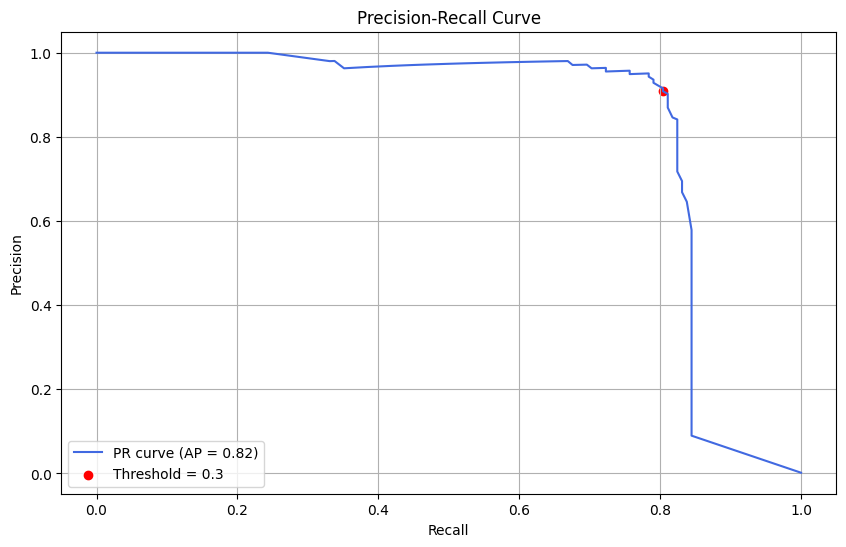

# 📊 Results & Model Evaluation

This document presents the performance of the fraud detection model, focusing on:

- Classification metrics
- Observations from the prediction results
- Visual analysis of fraud detection zones

---

## Final Evaluation (Threshold = 0.30)

| Class | Precision | Recall | F1-score | Support |
|-------|-----------|--------|----------|---------|
| 0 (Non-Fraud) | 1.00 | 1.00 | 1.00 | 85,295 |
| 1 (Fraud)     | 0.92 | 0.80 | 0.86 | 148 |

**Macro Avg F1-score**: 0.93  
**ROC AUC**: `0.9211`

---

## 📉 Threshold Analysis

| Threshold | Precision | Recall | F1-score |
|-----------|-----------|--------|----------|
| 0.10      | 0.73      | 0.82   | 0.77     |
| 0.20      | 0.82      | 0.82   | 0.82     |
| 0.30      | 0.92      | 0.80   | 0.86     |
| 0.40      | 0.95      | 0.78   | 0.86     |
| 0.50      | 0.96      | 0.74   | 0.84     |
| 0.60      | 0.96      | 0.72   | 0.82     |
| 0.70      | 0.98      | 0.65   | 0.78     |
| 0.80      | 0.98      | 0.58   | 0.73     |
| 0.90      | 0.97      | 0.44   | 0.60     |

> A threshold of `0.30` or `0.40` provides a good tradeoff.

---

  

> This curve shows how precision and recall evolve as the threshold changes.

---

## 🧪 Comparison with XGBoost

| Threshold | Precision | Recall | F1-score |
|-----------|-----------|--------|----------|
| 0.90      | 0.92      | 0.74   | 0.82     |

As a benchmark, an XGBoost classifier was also tested with default parameters and minimal tuning.

While its performance was slightly lower on this dataset, this does **not** imply that XGBoost is inferior — rather, it reflects that:

- The XGBoost pipeline wasn’t fully optimized.
- Interpretability and simplicity were prioritized in this project.

> You’ll find the benchmark summary in [this notebook at commit 5b60010](https://github.com/cfrBernard/ML-Fraud-Analysis/blob/5b60010/notebooks/02_modeling.ipynb)

---

> ## ℹ️ Notes

> - All metrics are based on a balanced test set (stratified sample: 148 frauds over ~85,000 transactions).
> - Evaluation excludes undersampling/oversampling tricks to preserve interpretability and realistic deployment assumptions.
